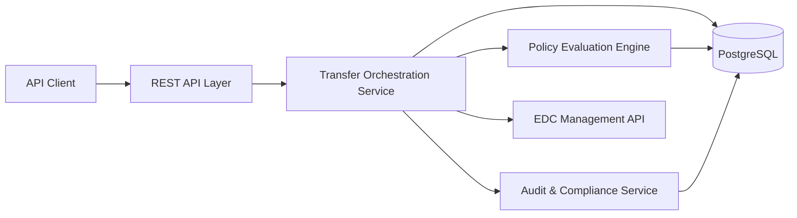
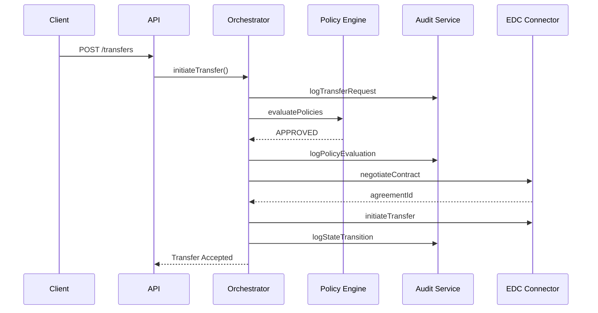
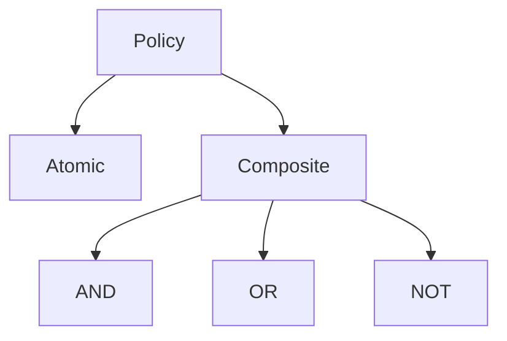

# Architecture – Policy-Aware Transfer Orchestration Service

## 1. Overview

This document describes the architecture of the **Policy-Aware Data Transfer Orchestration Service** built on top of **Eclipse EDC** for Catena-X–compliant dataspaces.

The system acts as an **intelligent orchestration layer** that evaluates business, compliance, and sovereignty policies *before* initiating data transfers via EDC connectors, while ensuring resilience, traceability, and auditability.

---

## 2. High-Level Architecture

### 2.1 Component Diagram



### Responsibilities

| Component             | Responsibility                                      |
| --------------------- | --------------------------------------------------- |
| REST API Layer        | Exposes transfer, audit, and analytics APIs         |
| Transfer Orchestrator | Manages lifecycle, state transitions, retries       |
| Policy Engine         | Evaluates composable business & compliance policies |
| Audit Service         | Immutable, append-only audit logging                |
| Persistence Layer     | Transfer state, policies, audit logs                |
| EDC Client            | Abstraction over EDC Management API                 |

---

## 3. Transfer Lifecycle & Sequence

### 3.1 Transfer Lifecycle States

```
REQUESTED → POLICY_EVALUATION → APPROVED / DENIED
APPROVED → CONTRACT_NEGOTIATION → NEGOTIATED
NEGOTIATED → TRANSFER_IN_PROGRESS → COMPLETED / FAILED / CANCELLED
```

Each transition is:

* Transactionally persisted
* Logged as an audit event
* Recoverable after restart

---

### 3.2 Sequence Diagram – Happy Path



---

## 4. Policy Evaluation Architecture

### 4.1 Policy Model

Policies are modeled as **composable domain objects**:

* Atomic policies (Time, RateLimit, Geographic, Certification)
* Composite policies (AND, OR, NOT)



### 4.2 Evaluation Flow

1. Load policy definitions from DB / configuration
2. Build policy tree
3. Evaluate against `PolicyContext`
4. Short-circuit on first failure
5. Return explicit violation reasons

Policies are **always evaluated before EDC contract negotiation**.

---

## 5. State Management Strategy

### 5.1 Persistence

* Transfer state stored in PostgreSQL
* Each transition saved in a single transaction
* Audit logs are append-only

### 5.2 Restart Recovery

On restart:

* Transfers in `TRANSFER_IN_PROGRESS` are re-polled from EDC
* Failed negotiations can be retried
* No in-memory state required for correctness

---

## 6. Failure Handling & Resilience

### 6.1 Retry Strategy

* Exponential backoff using **Resilience4j**
* Applied to:

    * Contract negotiation
    * Transfer initiation
    * Transfer status polling

```yaml
maxAttempts: 3
initialDelay: 2s
multiplier: 2
```

### 6.2 Failure Outcomes

| Scenario              | Result            |
| --------------------- | ----------------- |
| Policy violation      | DENIED (no retry) |
| Temporary EDC failure | RETRY             |
| Permanent EDC failure | FAILED            |
| Client cancellation   | CANCELLED         |

---

## 7. Scalability Considerations

* Stateless REST APIs
* Database-backed state machine
* Horizontal scaling via Kubernetes
* Connection pooling for EDC HTTP calls
* Optional async orchestration via message queue

Designed to scale to **10,000+ concurrent transfers**.

---

## 8. Observability & Monitoring

### Metrics

* Transfers by state
* Policy denials by type
* Retry counts
* Transfer duration

### Logging

* Structured logs (SLF4J)
* Correlation IDs per transfer

### Health Checks

* Database connectivity
* EDC API reachability

---

## 9. Data Sovereignty & GAIA-X Compliance

* Policies enforce:

    * Geographic restrictions (EU-only)
    * Usage limitations
    * Certification requirements

* Audit logs provide:

    * Who accessed data
    * Under which policy
    * At what time

This ensures compliance with **GAIA-X** and **GDPR** requirements.

---

## 10. Extensibility & Future Enhancements

* Event-driven orchestration (Kafka)
* Distributed rate limiting (Redis)
* Real-time analytics dashboard
* Custom EDC extensions
* Policy DSL / Rego integration

---

## 11. Key Architectural Principles

* Policy-first design
* Strong consistency for state
* Explicit failure handling
* Clear separation of concerns
* Production-readiness over over-engineering

---

## 12. Summary

This architecture provides a **robust, scalable, and compliant orchestration layer** on top of Eclipse EDC, suitable for real-world Catena-X automotive data-sharing scenarios while remaining simple enough to implement within the scope of the assignment.
